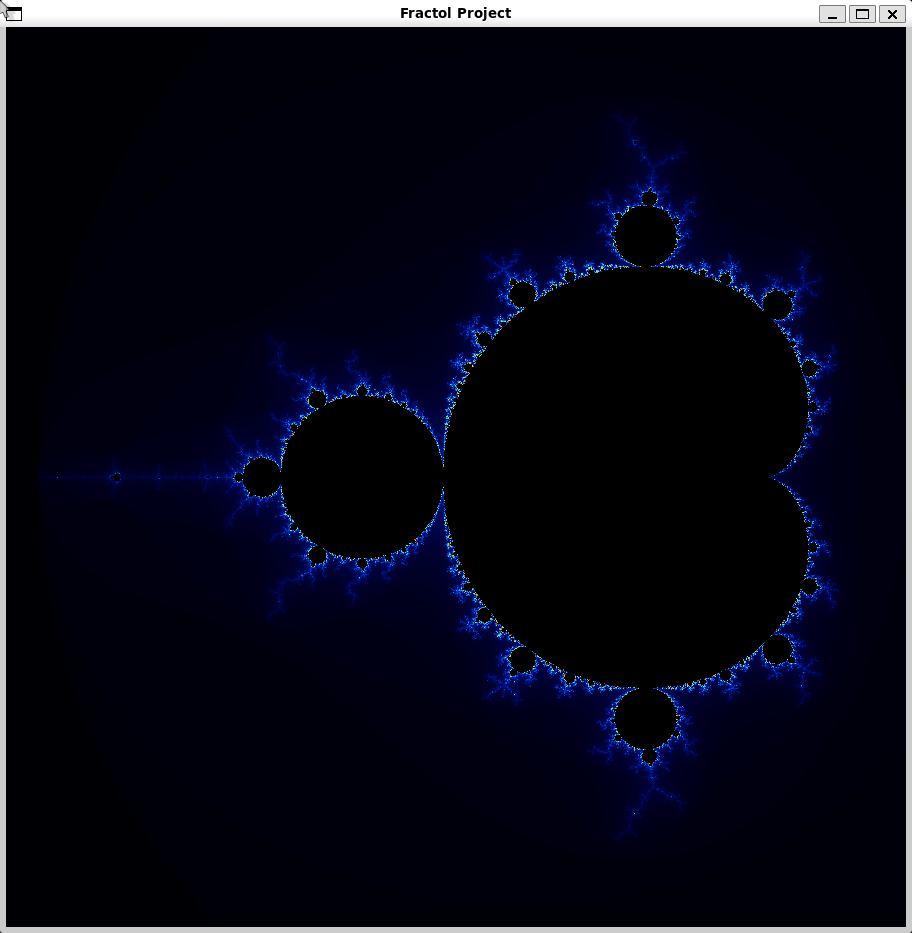
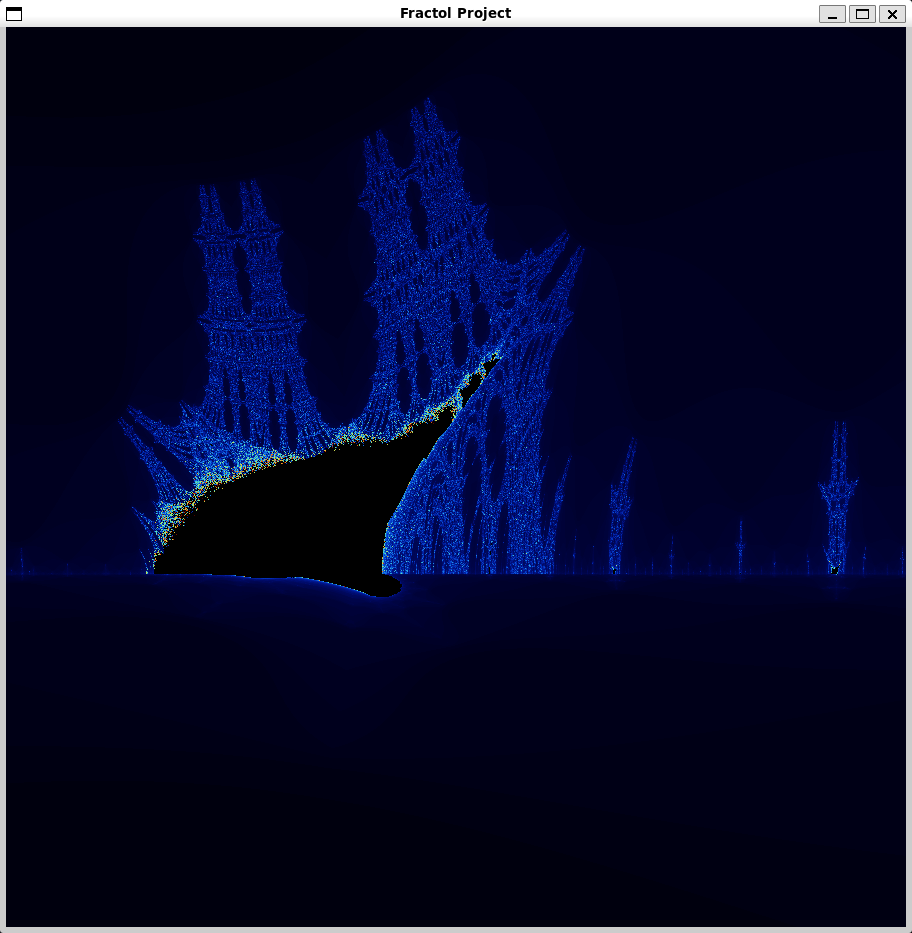

# 🌌 Fractol - Fractal Explorer

<div align="center">

</div>

<div align="center">

 
 


</div>

**Fractol**, karmaşık sayılar dünyasında matematiksel güzelliği keşfetmek için tasarlanmış interaktif bir fraktal görselleştirme aracıdır. Bu proje, 42 Okulu'nun grafik programlama müfredatının bir parçası olarak geliştirilmiş olup, matematiksel sanatın büyüleyici dünyasına bir pencere açar.

## 📖 İçindekiler

- [Özellikler](#-özellikler)
- [Desteklenen Fraktallar](#-desteklenen-fraktallar)
- [Kurulum](#-kurulum)
- [Kullanım](#-kullanım)
- [Kontroller](#-kontroller)
- [Bonus Özellikler](#-bonus-özellikler)
- [Matematik Arkası](#-matematik-arkası)
- [Galeri](#-galeri)
- [Teknik Detaylar](#-teknik-detaylar)

## ✨ Özellikler

### 🎯 Temel Özellikler
- **Gerçek Zamanlı Renderring**: Yüksek performanslı fraktal hesaplama
- **Zoom Desteği**: Mouse scroll ile sınırsız yakınlaştırma
- **Panning**: Fraktal üzerinde serbestçe gezinme
- **Interaktif Kontroller**: Klavye ve mouse ile tam kontrol
- **Özelleştirilebilir Julia Setleri**: Kendi parametrelerini belirle

### 🎨 Görsel Özellikler
- **Renk Gradyanları**: Matematiksel güzelliği yansıtan renk paletleri
- **Yüksek Çözünürlük**: 600x600 piksel temel, 900x900 piksel bonus
- **Dinamik İterasyon**: Zoom seviyesine göre otomatik detay ayarı
- **Smooth Rendering**: Kesintisiz görsel deneyim

## 🔥 Desteklenen Fraktallar

### 🌀 Mandelbrot Seti
En ünlü fraktal olan Mandelbrot seti, karmaşık sayılar düzleminde `z = z² + c` iterasyonu ile oluşturulur.

```bash
./fractol mandelbrot
```

### 🎭 Julia Seti
Her Julia seti, farklı bir sabit `c` değeri ile `z = z² + c` iterasyonu kullanır.

```bash
./fractol julia                    # Varsayılan değerler
./fractol julia -0.7 0.27015      # Özel parametreler
./fractol julia -0.75 0.11        # Başka bir örnek
```

### 🔥 Burning Ship (Bonus)
Mandelbrot'un yaratıcı bir varyasyonu olan Burning Ship fraktali.

```bash
./fractol burning_ship
```

## 🚀 Kurulum

### Gereksinimler
- **GCC** veya uyumlu C derleyicisi
- **MinilibX** (proje ile birlikte gelir)
- **X11** development kütüphaneleri (Linux)
- **Math** kütüphanesi

### Derleme
```bash
# Temel versiyon
make

# Bonus özellikleri ile
make bonus

# Temizleme
make clean
make fclean

# Yeniden derleme
make re
```

## 🎮 Kullanım

### Temel Başlatma
```bash
# Mandelbrot seti
./fractol mandelbrot

# Julia seti (varsayılan parametreler)
./fractol julia

# Julia seti (özel parametreler)
./fractol julia [gerçek_kısım] [sanal_kısım]
```

### Örnek Çalıştırmalar
```bash
# Klasik Julia seti
./fractol julia -0.75 0.11

# Ejder benzeri Julia
./fractol julia -0.7 0.27015

# Spiral Julia
./fractol julia -0.8 0.156

# Burning Ship (bonus)
./fractol burning_ship
```

## 🎯 Kontroller

### 🖱️ Mouse Kontrolleri
- **Scroll Up**: Zoom yapma (1.2x)
- **Scroll Down**: Zoom açma (0.8x)
- **Zoom Point**: Mouse'un olduğu noktaya zoom

### ⌨️ Klavye Kontrolleri
- **ESC**: Programı kapatma
- **R**: Reset (başlangıç konumuna dönüş)

### 🎨 Bonus Kontrolleri
- **Arrow Keys**: Manuel panning (yukarı/aşağı/sağa/sola)
- **C**: Renk şeması değiştirme
- **Gelişmiş Zoom**: Logaritmik zoom algoritması

## 🌟 Bonus Özellikler

### 🎨 Çoklu Renk Şemaları
Bonus versiyonda 3 farklı renk şeması:
- **Şema 1**: Klasik mavi-mor gradyan
- **Şema 2**: Sıcak renkler (kırmızı-sarı)
- **Şema 3**: Soğuk renkler (yeşil-mavi)

### 📐 Gelişmiş Matematiği
- **Burning Ship Fraktali**: `z = (|Re(z)| + i|Im(z)|)² + c`
- **Daha Yüksek Çözünürlük**: 900x900 piksel
- **Artırılmış İterasyon**: 500 iterasyon limiti
- **Adaptive Coloring**: Zoom seviyesine göre renk ayarı

## 🧮 Matematik Arkası

### Mandelbrot Algoritması
```c
// z = z² + c iterasyonu
z_new.re = z.re * z.re - z.im * z.im + c.re;
z_new.im = 2 * z.re * z.im + c.im;
```

### Julia Algoritması
```c
// Sabit c değeri ile z = z² + c
// z başlangıç değeri piksel koordinatından alınır
// c değeri kullanıcı tarafından belirlenir
```

### Burning Ship Algoritması
```c
// z = (|Re(z)| + i|Im(z)|)² + c
z_new.re = abs(z.re) * abs(z.re) - abs(z.im) * abs(z.im) + c.re;
z_new.im = 2 * abs(z.re) * abs(z.im) + c.im;
```

### Renk Hesaplama
```c
// Smooth coloring algoritması
t = (double)iteration / max_iterations;
red = (int)(9 * (1-t) * t * t * t * 255);
green = (int)(15 * (1-t) * (1-t) * t * t * 255);
blue = (int)(8.5 * (1-t) * (1-t) * (1-t) * t * 255);
```

## 🖼️ Galeri

### Mandelbrot Seti

*Klasik Mandelbrot seti - matematiksel güzelliğin en ikonik örneği*

### Julia Seti
.png)
*Julia seti (c = -0.355 - 0.355i) - karmaşık parametrelerle oluşan sanat*

### Burning Ship

*Burning Ship fraktali - Mandelbrot'un yaratıcı varyasyonu*

## 🔧 Teknik Detaylar

### 📊 Performans Optimizasyonları
- **Compiler Flags**: `-O3` optimizasyon seviyesi
- **Efficient Pixel Access**: Doğrudan bellek erişimi
- **Smart Iteration**: Zoom seviyesine göre dinamik iterasyon
- **Memory Management**: Optimum bellek kullanımı

### 🏗️ Kod Yapısı
```
fractol/
├── main.c              # Ana program mantığı
├── fractals.c          # Fraktal hesaplama algoritmalarını
├── hooks.c             # Event handling (mouse, keyboard)
├── fractal_utils.c     # Fraktal yardımcı fonksiyonları
├── pixel_utils.c       # Piksel ve renk hesaplamaları
├── program_utils.c     # Program başlatma ve setup
├── arg_utils.c         # Argument parsing ve validasyon
├── fractol.h           # Ana header dosyası
├── *_bonus.c           # Bonus özellikler
├── fractol_bonus.h     # Bonus header dosyası
└── img/                # Örnek fraktal görüntüleri
```

### 🛠️ Makefile Özellikleri
- **Parallel Compilation**: `-j16` flag ile hızlı derleme
- **Clean Build System**: Otomatik dependency management
- **MinilibX Integration**: Otomatik kütüphane derleme
- **Bonus Support**: Ayrı bonus compilation

### 🎯 Kullanılan Kütüphaneler
- **MinilibX**: Grafik rendering ve window management
- **Math.h**: Matematiksel hesaplamalar
- **Stdlib.h**: Bellek yönetimi
- **Unistd.h**: System calls

## 🎨 Değişkenler ve Ayarlar

### Temel Ayarlar
```c
#define SIZE 600           // Pencere boyutu
#define ITERATION 100      // Maksimum iterasyon
#define JULIA_C_RE -0.75   // Varsayılan Julia gerçek kısım
#define JULIA_C_IM 0.11    // Varsayılan Julia sanal kısım
```

### Bonus Ayarlar
```c
#define SIZE 900           // Daha büyük pencere
#define ITERATION 500      // Daha yüksek detay
```

## 🚀 Gelecek Planları

- [ ] **Multi-threading**: Daha hızlı rendering
- [ ] **GPU Acceleration**: CUDA/OpenCL desteği
- [ ] **Animation**: Parametre animasyonları
- [ ] **Export**: PNG/JPG kaydetme
- [ ] **More Fractals**: Newton, Tricorn, vs.

## 📝 Lisans

Bu proje 42 Okulu'nun eğitim müfredatı kapsamında geliştirilmiştir.

---

**Geliştirici**: [Kutay Batur](https://github.com/kutay07)  
**Proje**: 42 School - Fractol  
**Tarih**: 2025  

*Matematiksel sanatın büyülü dünyasına hoş geldiniz! 🌌*
